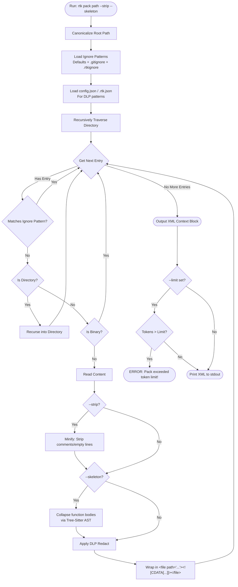

# AI Token Saver (RTK) 🚀

[](https://github.com/andreafinazziinfo/ai-token-saver/actions/workflows/ci.yml)
[](https://github.com/andreafinazziinfo/ai-token-saver/actions/workflows/release.yml)
[](https://github.com/andreafinazziinfo/ai-token-saver/actions/workflows/codeql.yml)
[](https://opensource.org/licenses/Apache-2.0)

> **The ultimate toolkit to stop AI Context Window exhaustion and slash your LLM API costs by up to 95%.**

[](https://crates.io/crates/rtk)
[](https://www.rust-lang.org)
[](https://github.com/andreafinazziinfo/ai-token-saver/stargazers)
[](https://github.com/andreafinazziinfo/ai-token-saver/issues)
[](https://github.com/andreafinazziinfo/ai-token-saver/network/members)

**AI Token Saver (RTK)** is a high-performance, Rust-based CLI designed to aggressively optimize how Autonomous Agents (like Claude Code, Cursor, Windsurf, Antigravity) interact with your project.

Modern LLMs are incredibly smart, but they suffer from *Context Window Exhaustion*: they fill their memory with useless terminal logs (like 1000 lines of `npm install` warnings) and long reasoning loops, causing them to slow down, hallucinate, and rack up massive API bills.

RTK solves this by intercepting commands, stripping the noise, caching the raw data in a local FTS5 vector database, and returning only the pure semantic signal. By enforcing YAGNI developer behaviors and compressing outputs, the toolkit saves an **average of 82.4% of tokens** across 17 verified scenarios (ranging from 41% to 96%).

---

## ✨ Features & Benchmarks — Average **82.4%** Token Savings

RTK optimizes the entire lifecycle of an Autonomous Agent across **3 phases**: Input → Reasoning → Output.

> **Methodology**: All benchmarks below were generated by our internal [`benchmark.py`](scripts/benchmark.py) token-counting suite using the official `tiktoken cl100k_base` BPE tokenizer. Real commands were executed against the RTK codebase itself. Simulated scenarios use industry-standard mock data matching each tool's documented output format. Output profile benchmarks are sourced from [Caveman](https://github.com/JuliusBrussee/caveman) and [Ponytail](https://github.com/DietrichGebert/ponytail).

### 📥 Phase 1: Input Virtualization (What the AI reads) — Avg **82.5%**

RTK intercepts noisy terminal outputs, caches the full text in SQLite, and returns only the essential signal.

| Feature | Command / Scenario | Standard | RTK | Savings |
| :--- | :--- | ---: | ---: | :--- |
| 🦀 **Cargo Test** | `rtk cargo test` (REAL, 79 tests) | 1,290 | **94** | **📉 92.7%** |
| 🦀 **Cargo Build** | `rtk cargo build` (30 crates) | 482 | **95** | **📉 80.3%** |
| 🦀 **Cargo Test** | `rtk cargo test` (50 tests, 1 failure) | 710 | **112** | **📉 84.2%** |
| 📜 **Git Log** | `rtk git log` (20 commits) | 1,713 | **272** | **📉 84.1%** |
| 📜 **Git Log** | `rtk git log` (REAL, 15 commits) | 1,086 | **295** | **📉 72.8%** |
| 📜 **Git Diff** | `rtk git diff` (5 files, 15 changes) | 1,587 | **308** | **📉 80.6%** |
| 📜 **Git Status** | `rtk git status` (25 untracked) | 322 | **189** | **📉 41.3%** |
| 🐍 **Pytest** | `rtk pytest` (30 tests, 8 warnings) | 558 | **172** | **📉 69.2%** |
| 🐳 **Docker Build** | `rtk docker build` (8 layers) | 2,506 | **186** | **📉 92.6%** |
| 🟣 **.NET Build** | `rtk dotnet test` (49 tests) | 245 | **41** | **📉 83.3%** |
| 🐹 **Go Test** | `rtk go_test` (20 tests) | 375 | **41** | **📉 89.1%** |
| ☕ **Gradle** | `rtk gradle build` (14 tasks) | 114 | **21** | **📉 81.6%** |
| 📦 **NPM Install** | `rtk npm install` (40 packages) | 831 | **259** | **📉 68.8%** |
| 📂 **LS Recursive** | `rtk ls -laR` (50 files) | 1,473 | **519** | **📉 64.8%** |
| 🗜️ **Context Pack** | `rtk pack --strip --skeleton` (REAL) | 41,035 | **6,894** | **📉 83.2%** |

### 🧠 Phase 2: Reasoning & Memory (The "Middle") — **96.5%**

LLMs bloat the context window with long reasoning loops and repeated rule lookups. RTK offloads them to the database.

| Feature | What it does | Savings |
| :--- | :--- | :--- |
| 🤫 **Hidden Chain-of-Thought** | `cat <<EOF \| rtk think` offloads 462-token reasoning blocks to SQLite. Only 16 tokens returned. | **📉 96.5%** |
| 🧠 **Semantic Memory** | `rtk memory set/get/search` stores architectural decisions across sessions. | Eliminates RAG decay |
| 🔒 **DLP Redaction** | Auto-redacts API keys, JWT, PEM keys, DB credentials, high-entropy secrets. | 🛡️ 100% Safety |

### 📤 Phase 3: Output Autonomy (What the AI writes)

RTK injects system prompts that force the AI to use ultra-compressed communication and minimalist code.

| Feature | What it does | Validated Savings |
| :--- | :--- | :--- |
| 🗣️ **Caveman Profile** | Injects ultra-compressed personas into the AI's system prompt. | **📉 ~75% Tokens** (Tested by [Caveman](https://github.com/JuliusBrussee/caveman)) |
| 🧑‍💻 **Ponytail Profile** | Prevents over-engineered code generation (YAGNI, stdlib-first). | **📉 ~54% less code** (Tested by [Ponytail](https://github.com/DietrichGebert/ponytail)) |
| 🚀 **Dynamic Autonomy** | Warns the AI when output exceeds 3,000-token safety thresholds. | Auto-correction enabled |

### 💰 Cost & Time Savings (Monthly Projection: 50 commands/day)

| Model | Input $/MTok | Output $/MTok | Monthly Savings |
| :--- | ---: | ---: | ---: |
| **Claude Sonnet 4.6** | $3.00 | $15.00 | **$204/mo** |
| **Claude Opus 4.8** | $5.00 | $25.00 | **$340/mo** |
| **GPT-5.5** | $5.00 | $30.00 | **$340/mo** |
| **GPT-5.4** | $2.50 | $15.00 | **$170/mo** |
| **Gemini 3.1 Pro** | $2.00 | $12.00 | **$136/mo** |
| **Gemini 3.5 Flash** | $1.50 | $9.00 | **$102/mo** |

> ⏱️ **Time saved**: ~22.7 seconds per command → **9.5 hours/month** of reduced AI waiting time.

---

## ⚙️ Installation & Setup

1. **Requirements**: Rust toolchain (Cargo), Bash-compatible shell.
2. **Install**:
   ```bash
   bash install.sh
   ```
3. **Initialize AI Profiles & Auto-Install** (in your workspace):
   ```bash
   rtk init --profile high
   ```
   *Note: This automatically appends RTK aliases to your `~/.bashrc`, `~/.zshrc`, and `~/.profile`.*

<details>
<summary><b>4. AI / IDE Integration (Click to expand)</b></summary>

**For Claude Code (PreToolUse Hook)**
Add this to your `settings.json` (`~/.claude/settings.json` or `%USERPROFILE%\.gemini\antigravity\settings.json`):
```json
  "hooks": {
    "PreToolUse": [
      {
        "matcher": "Bash",
        "hooks": [{ "type": "command", "command": "bash /absolute/path/to/ai-token-saver/hooks/rtk-rewrite.sh", "timeout": 5000 }]
      }
    ]
  }
```

**For Terminals (Cursor, Aider, Bash/Zsh)**
If you didn't use the auto-installer, add these aliases to your `~/.bashrc` or `~/.zshrc`:
```bash
alias git="rtk git"
alias cargo="rtk cargo"
alias pytest="rtk pytest"
alias ls="rtk ls"
alias npm="rtk npm"
alias yarn="rtk yarn"
alias pnpm="rtk pnpm"
alias dotnet="rtk dotnet"
alias composer="rtk composer"
alias terraform="rtk terraform"
```
</details>

---

## 💻 Command Reference

*   **Input Wrappers (15 tools)**: `rtk git status/diff/log`, `rtk cargo test/build/check`, `rtk pytest`, `rtk docker`, `rtk npm`, `rtk yarn`, `rtk pnpm`, `rtk composer`, `rtk terraform`, `rtk dotnet`, `rtk gradle`, `rtk go_test`, `rtk ls`.
*   **Context Virtualization**: `rtk show-log <id>` (reads full uncompressed log), `rtk gc` (cleans old DB logs and reclaims space).
*   **Directory Packing**: `rtk pack [path] [--strip] [--skeleton] [--limit 50000]`.
*   **Project Memory & Search**: `rtk memory set <key> <val>`, `rtk memory get <key>`, `rtk memory list`, `rtk memory search <query>`.
*   **Hidden Chain-of-Thought**: `rtk think` (reads from stdin to store reasoning in the FTS5 DB out of the chat context).
*   **Rules & Profiles**: `rtk init --profile <low|medium|high|max>`, `rtk sync-rules` (recursively mirrors `.cursor/rules` to subprojects).
*   **Command Rewriting**: `rtk rewrite "<command>"` (PreToolUse hook engine: auto-allows, denies, or asks for dangerous commands).
*   **Configuration**: `rtk config show`, `rtk config deny add "<pattern>"`, `rtk config dlp add "<regex>"`.
*   **Telemetry & Status**: `rtk status`, `rtk stats`, `rtk dashboard`.

<details>
<summary><b>Personal Configuration & Guardrails (Click to expand)</b></summary>

RTK uses `~/.config/rtk/config.json` and local `.rtk.json`. 
*   **Show config**: `rtk config show`
*   **Add Guardrail**: `rtk config deny add "git push.*--force"` (Prevents AI from running this).
*   **Add DLP Regex**: `rtk config dlp add "MY_API_KEY_[0-9a-zA-Z]{32}"` (Redacts custom secrets).

```mermaid
sequenceDiagram
    actor LLM as AI Agent / Developer
    participant Hook as Shell Hook (PreToolUse)
    participant RTK as RTK CLI
    participant Filter as Filters (15 Modules)
    participant DLP as DLP Redaction
    participant DB as SQLite FTS5 DB
    participant Cmd as Target Command

    rect rgb(30, 60, 100)
    Note over LLM,Cmd: 📥 PHASE 1 — INPUT VIRTUALIZATION
    LLM->>Hook: Execute Command (e.g. cargo test)
    Hook->>RTK: rtk rewrite "cargo test"
    alt Rewrite Matched (Exit 0)
        RTK-->>Hook: Rewritten to rtk cargo test
        Hook->>RTK: Run: rtk cargo test
        RTK->>Cmd: Execute cargo test
        Cmd-->>RTK: Raw Output (1,290 tokens)
        RTK->>Filter: cargo_test::filter()
        Filter-->>RTK: Filtered Output (94 tokens, -92.7%)
        RTK->>DLP: Redact Secrets (API keys, JWT, PEM)
        DLP-->>RTK: Clean Output
        RTK->>DB: Cache Raw Log (id=42)
        RTK-->>LLM: Filtered Output + [rtk show-log 42]
    else Denied (Exit 2)
        RTK-->>Hook: BLOCKED (e.g. git push --force)
    else No Match (Exit 1)
        Hook->>Cmd: Passthrough original command
    end
    end

    rect rgb(60, 30, 80)
    Note over LLM,DB: 🧠 PHASE 2 — REASONING & MEMORY
    LLM->>RTK: cat <<EOF | rtk think (462 tokens)
    RTK->>DB: Store in FTS5 Memory
    RTK-->>LLM: [Thought offloaded] (16 tokens, -96.5%)
    LLM->>RTK: rtk memory set db_port 5432
    RTK->>DB: Store Key-Value Pair
    LLM->>RTK: rtk memory search "database"
    RTK->>DB: FTS5 Semantic Search
    DB-->>RTK: Matching Entries
    RTK-->>LLM: Relevant Context
    end

    rect rgb(30, 80, 50)
    Note over LLM,Cmd: 📤 PHASE 3 — OUTPUT AUTONOMY
    LLM->>RTK: rtk init --profile high
    RTK->>RTK: Inject Caveman (~75% output reduction)
    RTK->>RTK: Inject Ponytail (~54% less code)
    RTK-->>LLM: AI rules installed in .cursor/rules/
    Note over RTK: check_autonomy() monitors output > 3000 tokens
    end
```

</details>

<details>
<summary><b>Architecture & Workflow (Click to expand)</b></summary>



**Context Directory Packaging (`rtk pack`)**

</details>

---

## 🤖 AI Agent Guide (Readiness & Instructions)

> [!NOTE]
> This section is specifically written for AI Coding Assistants to read and follow. If you are an AI agent, you MUST follow these guidelines.

1. **Intercepted Commands**: Running standard tools (e.g., `pytest`, `cargo test`) yields filtered outputs. If a log is truncated, a cache note appears. **DO NOT re-run the command** to view failures; instead, run `rtk show-log <id>` to retrieve the raw database record.
2. **Context Packaging**: DO NOT execute `cat` on many files. Use `rtk pack . --strip` to read directories. Pass `--limit <max_tokens>` to prevent overflows. Use `--skeleton` to collapse function bodies into API signatures.
3. **Long-Term State Memory**: Use `rtk memory set/get` to save project-specific settings (like open ports, DB URLs, architecture decisions) across chat sessions. Use `rtk memory search` for semantic retrieval.
4. **Hidden Chain-of-Thought**: When solving complex logic, **DO NOT write long reasoning in the chat**. Pipe it to `rtk think` (e.g., `cat << 'EOF' | rtk think`) to save output tokens, and only print a brief summary to the user.
5. **Stale Context Rule**: If you modify the project's architecture, you MUST proactively overwrite old rules using `rtk memory set <key> <val>` to prevent stale RAG context hallucinations.
6. **DLP Awareness**: RTK automatically redacts API keys, JWT tokens, PEM private keys, and database credentials from all outputs. If you see `[REDACTED_API_KEY]` or `[REDACTED_SECRET]`, do NOT attempt to reconstruct or guess the original value.
7. **Guardrails**: RTK blocks dangerous commands like `rm -rf /`, `git push --force`, `git reset --hard`. If your command is denied, respect the guardrail and use a safer alternative.
8. **Behavioral Rules**: RTK enforces *Ponytail* and *Caveman* styles. Implement the minimal amount of code possible. **DO NOT write boilerplate, unrequested features, or restructure folders.** Keep diffs extremely narrow.

---

## 📄 License
Licensed under the **Apache License 2.0**.
