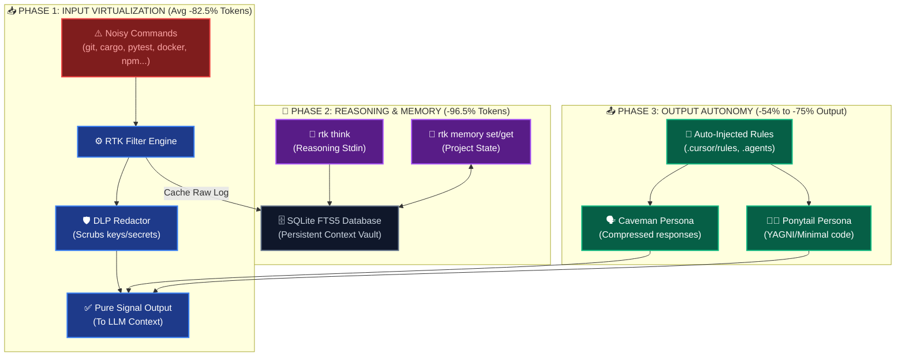

# Introduction

**Runtime Token Toolkit (RTK)** is a high-performance developer efficiency toolkit written in Rust, designed to aggressively optimize how Autonomous AI Agents (like Claude Code, Cursor, Windsurf, Aider, and Antigravity) interact with your project codebase.

By acting as a proxy, interceptor, and persistent memory vault, RTK slashes LLM API input costs by an average of **82.4%**, reduces response latencies, and avoids the dreaded Context Window Exhaustion.

---

## The Problem: Context Window Bloat

Modern Large Language Models (LLMs) have vast context windows, but their reasoning speed, accuracy, and operational cost are highly sensitive to context size. When developers let autonomous agents execute raw shell commands, the AI reads:
* Massive terminal outputs (e.g., hundreds of lines of `npm install` warnings or compiler diagnostics).
* Verbatim source file dumps containing boilerplate and comments irrelevant to the task.
* Redundant system rule lookups repeated on every invocation.

This results in:
1. **API Cost Inflation**: You pay for thousands of redundant context tokens on every request.
2. **Speed Decay**: LLM response latency increases dramatically as the context window fills.
3. **Hallucinations & Degradation**: LLMs struggle to attend to key information when buried under terminal noise (the "needle in a haystack" problem).

---

## The Solution: Three-Phase Efficacy Pipeline

RTK intercepts developer interactions and optimizes the workspace across three key lifecycle phases of an autonomous agent:

### 1. Phase 1: Input Virtualization (Avg -82.5% Tokens)
Instead of feeding full terminal logs to the LLM, RTK filters standard development tool outputs down to their logical results. 
* A successful test suite of 80 tests is summarized into a single line (`OK: 80 tests passed`).
* Failure logs are parsed, presenting only the specific stack traces or error locations, accompanied by a command to retrieve the full log if needed.
* All raw execution logs are cached in a local SQLite DB for on-demand retrieval (`rtk show-log <id>`).

### 2. Phase 2: Reasoning & Memory (Avg -96.5% Tokens)
RTK shifts reasoning overhead out of the active prompt sequence:
* **Offloaded Reasoning**: Using `rtk think`, agents can store intermediate thoughts, checklists, or scratchpads in SQLite. Only a tiny confirmation token is returned to the active chat session.
* **Persistent Semantic Memory**: Using FTS5 search, RTK acts as a workspace-wide context server. Key information like API ports, DB schemas, or design decisions are stored as persistent semantic variables.
* **DLP Shielding**: Redacts API keys, high-entropy secrets, and credentials dynamically before output reaches the agent.

### 3. Phase 3: Output Autonomy (Avg -54% to -75% Output)
RTK configures system rules and directory preferences targeting the model's writing behavior:
* **Caveman Profile**: Encourages ultra-dense, low-token communication styles.
* **Ponytail Profile**: Enforces YAGNI (You Aren't Gonna Need It) code generation, preventing AI models from writing bloated boilerplates or adding unrequested helper modules.
