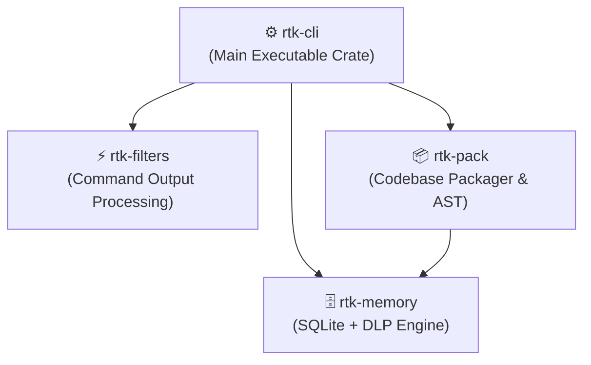
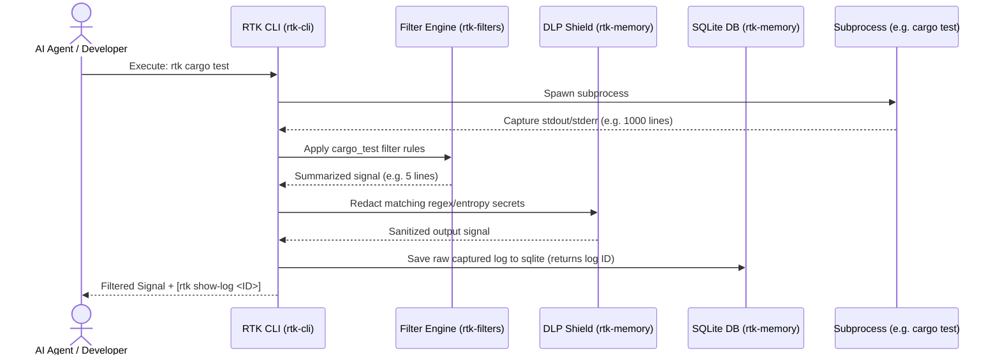

# Architecture & Design

RTK is structured as a modular Rust Cargo workspace to ensure separation of concerns, high maintainability, and rapid compilation times. 

---

## Workspace Layout

The project is split into four distinct crates under the `rtk/` folder:

### 1. `rtk-cli` (Executable)
* **Path**: `rtk/rtk-cli`
* **Purpose**: Coordinates CLI args parsing (via `clap`), config loading (`toml`), and process wrapping.
* **Responsibilities**: Executes target binaries, feeds stdout/stderr to filters, and handles output redirection. Implements the `rtk rewrite` shell hook interception mechanism.

### 2. `rtk-filters` (Library)
* **Path**: `rtk/rtk-filters`
* **Purpose**: Performs pure string-to-string stream transformations.
* **Responsibilities**: Parses noisy command logs and compresses them. Contains specific parsing rules for `cargo`, `git`, `go`, `docker`, `pytest`, `.NET`, `gradle`, and `npm`. It remains completely stateless.

### 3. `rtk-memory` (Library)
* **Path**: `rtk/rtk-memory`
* **Purpose**: Manages persistent state, semantic storage, and security sanitization.
* **Responsibilities**:
  * Interacts with the local SQLite FTS5 database to store command histories and semantic variables (`rtk memory`).
  * Runs the **Data Loss Prevention (DLP)** engine, scanning strings for credentials, API tokens, and secrets using regular expressions and Shannon entropy tests.

### 4. `rtk-pack` (Library)
* **Path**: `rtk/rtk-pack`
* **Purpose**: Compresses directories into LLM-friendly XML block models.
* **Responsibilities**: Traverses folders respecting `.gitignore`/`.rtkignore`, minifies code files, and parses Tree-Sitter AST syntax trees to generate skeletonized function profiles (collapsing bodies to save tokens).

---

## Command Lifecycle Data Flow

The following sequence shows how a shell command is intercepted and optimized:

---

## Why Rust?

Designing a shell wrapper requires strict performance and resource boundaries:
1. **Low Startup Latency**: Intercepting every command introduces overhead. Written in Rust, RTK launches and exits in **<10ms**, making it unnoticeable in everyday terminal use.
2. **Minimal Footprint**: Keeping memory consumption **<5MB** guarantees it doesn't starve development tools.
3. **No External Runtimes**: Compiled to a static binary, RTK requires no Node.js, Python, or Ruby installs, preventing runtime version mismatch issues.
